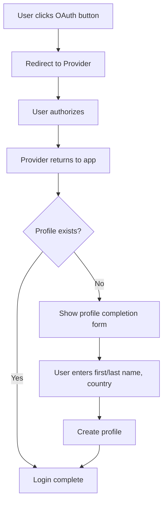
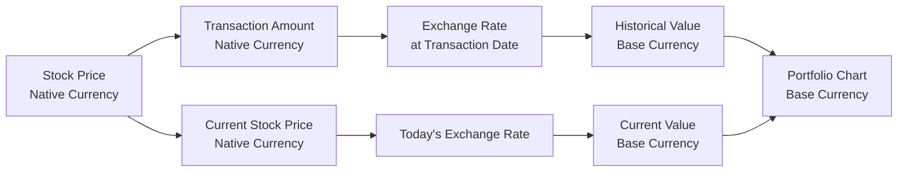

# Multi-Currency Portfolio Tracker Implementation Plan (Revised)

## Table of Contents
1. [Executive Summary](#executive-summary)
2. [Authentication & User Profile Enhancement](#authentication--user-profile-enhancement)
3. [Multi-Currency Architecture](#multi-currency-architecture)
4. [Portfolio Data Caching Strategy](#portfolio-data-caching-strategy)
5. [Implementation Phases](#implementation-phases)
6. [Technical Specifications](#technical-specifications)
7. [API Endpoints](#api-endpoints)
8. [Testing Strategy](#testing-strategy)

## Executive Summary

This document outlines the implementation plan for adding OAuth authentication (Google/Apple) and multi-currency support to the Portfolio Tracker application. The system will support users globally by handling transactions in multiple currencies while displaying all values in the user's chosen base currency.

### Key Features
- Google and Apple OAuth authentication
- User profile management (first name, last name, country)
- Multi-currency transaction support
- Automatic currency conversion using daily exchange rates
- All portfolio values displayed in user's base currency
- **Incremental portfolio data caching for performance**

### Core Principle
Every user has ONE base currency that determines how ALL monetary values are displayed throughout the application. Stock prices and transactions are converted from their native currency to this base currency.

---

## Authentication & User Profile Enhancement

### Current State
- Basic email/password authentication via Supabase
- No user profile information stored
- Email displayed in UI header

### Target State
- OAuth authentication (Google/Apple) + existing email/password
- User profiles with first name, last name, country
- First name displayed in UI instead of email
- Base currency preference stored per user

### Database Schema Changes

```sql
-- Create user profiles table
CREATE TABLE user_profiles (
  id UUID PRIMARY KEY DEFAULT gen_random_uuid(),
  user_id UUID REFERENCES auth.users(id) ON DELETE CASCADE,
  first_name VARCHAR(100) NOT NULL,
  last_name VARCHAR(100) NOT NULL,
  country VARCHAR(2) NOT NULL, -- ISO country code
  base_currency VARCHAR(3) NOT NULL DEFAULT 'USD',
  created_at TIMESTAMPTZ DEFAULT NOW(),
  updated_at TIMESTAMPTZ DEFAULT NOW(),
  UNIQUE(user_id)
);

-- Create RLS policies
ALTER TABLE user_profiles ENABLE ROW LEVEL SECURITY;

CREATE POLICY "Users can view own profile" 
  ON user_profiles FOR SELECT 
  USING (auth.uid() = user_id);

CREATE POLICY "Users can update own profile" 
  ON user_profiles FOR UPDATE 
  USING (auth.uid() = user_id);
```

### OAuth Implementation Flow



### Profile Completion Component

```typescript
interface ProfileCompletionForm {
  firstName: string;
  lastName: string;
  country: string;
  baseCurrency: string; // Auto-selected based on country
}

const ProfileCompletion: React.FC = () => {
  const [formData, setFormData] = useState<ProfileCompletionForm>({
    firstName: '',
    lastName: '',
    country: '',
    baseCurrency: 'USD'
  });

  // Auto-set currency based on country
  useEffect(() => {
    const currencyMap: Record<string, string> = {
      'US': 'USD',
      'AU': 'AUD',
      'GB': 'GBP',
      'JP': 'JPY',
      'DE': 'EUR',
      'FR': 'EUR',
      // ... more countries
    };
    
    if (formData.country) {
      setFormData(prev => ({
        ...prev,
        baseCurrency: currencyMap[formData.country] || 'USD'
      }));
    }
  }, [formData.country]);

  return (
    // Form UI implementation
  );
};
```

---

## Multi-Currency Architecture

### Core Concepts

1. **Stock Currency**: The currency in which a stock is traded (determined by exchange)
2. **Base Currency**: User's preferred display currency (all values shown in this currency)
3. **Exchange Rate**: Daily closing rate between two currencies

### Currency Flow Diagram



### Database Schema for Currency Support

```sql
-- Exchange rates table
CREATE TABLE exchange_rates (
  id UUID PRIMARY KEY DEFAULT gen_random_uuid(),
  from_currency VARCHAR(3) NOT NULL,
  to_currency VARCHAR(3) NOT NULL,
  rate DECIMAL(20,10) NOT NULL,
  date DATE NOT NULL,
  source VARCHAR(50) DEFAULT 'alphavantage',
  created_at TIMESTAMPTZ DEFAULT NOW(),
  UNIQUE(from_currency, to_currency, date)
);

-- Index for fast lookups
CREATE INDEX idx_exchange_rates_lookup 
  ON exchange_rates(from_currency, to_currency, date DESC);

-- Update stocks table
ALTER TABLE stocks 
  ADD COLUMN exchange VARCHAR(20),
  ADD COLUMN currency VARCHAR(3) NOT NULL DEFAULT 'USD';

-- Update common stock exchanges
UPDATE stocks SET 
  currency = CASE 
    WHEN symbol LIKE '%.AX' THEN 'AUD'
    WHEN symbol LIKE '%.L' THEN 'GBP'
    WHEN symbol LIKE '%.TO' THEN 'CAD'
    ELSE 'USD'
  END,
  exchange = CASE 
    WHEN symbol LIKE '%.AX' THEN 'ASX'
    WHEN symbol LIKE '%.L' THEN 'LSE'
    WHEN symbol LIKE '%.TO' THEN 'TSX'
    ELSE 'NASDAQ'
  END;

-- Update transactions table
ALTER TABLE transactions 
  ADD COLUMN stock_currency VARCHAR(3) DEFAULT 'USD',
  ADD COLUMN base_currency VARCHAR(3) DEFAULT 'USD',
  ADD COLUMN exchange_rate DECIMAL(20,10) DEFAULT 1.0,
  ADD COLUMN base_amount DECIMAL(20,8);

-- Migrate existing data
UPDATE transactions t
SET 
  stock_currency = s.currency,
  base_currency = 'USD', -- Default for existing users
  exchange_rate = 1.0,
  base_amount = t.total_amount
FROM stocks s
WHERE t.stock_id = s.id;
```

### Core Currency Service

```python
from decimal import Decimal
from datetime import date, timedelta
from typing import Optional, Dict, Tuple
import asyncio
from cachetools import TTLCache

class CurrencyService:
    """Handles all currency conversion operations"""
    
    def __init__(self, db, alpha_vantage_client):
        self.db = db
        self.av_client = alpha_vantage_client
        # Cache rates for 1 hour
        self.cache: TTLCache = TTLCache(maxsize=1000, ttl=3600)
        
    async def get_exchange_rate(
        self, 
        from_currency: str, 
        to_currency: str, 
        date: date
    ) -> Decimal:
        """
        Get exchange rate for a specific date.
        Uses cache -> database -> API fallback pattern.
        """
        # Same currency = 1.0
        if from_currency == to_currency:
            return Decimal('1.0')
            
        # Check cache
        cache_key = f"{from_currency}/{to_currency}/{date}"
        if cache_key in self.cache:
            return self.cache[cache_key]
            
        # Check database
        rate = await self._get_rate_from_db(from_currency, to_currency, date)
        if rate:
            self.cache[cache_key] = rate
            return rate
            
        # Fetch from API if not found
        rate = await self._fetch_and_store_rate(from_currency, to_currency, date)
        self.cache[cache_key] = rate
        return rate
        
    async def _get_rate_from_db(
        self, 
        from_currency: str, 
        to_currency: str, 
        date: date
    ) -> Optional[Decimal]:
        """Get rate from database, with fallback to previous days"""
        # Try exact date first
        result = await self.db.fetch_one(
            """
            SELECT rate FROM exchange_rates 
            WHERE from_currency = $1 
              AND to_currency = $2 
              AND date = $3
            """,
            from_currency, to_currency, date
        )
        
        if result:
            return Decimal(str(result['rate']))
            
        # Fallback: get most recent rate within 7 days
        result = await self.db.fetch_one(
            """
            SELECT rate FROM exchange_rates 
            WHERE from_currency = $1 
              AND to_currency = $2 
              AND date >= $3 
              AND date < $4
            ORDER BY date DESC 
            LIMIT 1
            """,
            from_currency, to_currency, date - timedelta(days=7), date
        )
        
        return Decimal(str(result['rate'])) if result else None
        
    async def _fetch_and_store_rate(
        self, 
        from_currency: str, 
        to_currency: str, 
        date: date
    ) -> Decimal:
        """Fetch rate from Alpha Vantage and store in database"""
        # Fetch daily rates from API
        fx_data = await self.av_client.get_fx_daily(from_currency, to_currency)
        
        # Store all returned rates (bulk insert for efficiency)
        rates_to_store = []
        target_rate = None
        
        for date_str, rate_info in fx_data['Time Series FX (Daily)'].items():
            rate_date = datetime.strptime(date_str, '%Y-%m-%d').date()
            rate = Decimal(rate_info['4. close'])
            
            rates_to_store.append({
                'from_currency': from_currency,
                'to_currency': to_currency,
                'rate': rate,
                'date': rate_date
            })
            
            if rate_date == date:
                target_rate = rate
                
        # Bulk insert rates
        await self._bulk_insert_rates(rates_to_store)
        
        # If specific date not found, use closest available
        if not target_rate and rates_to_store:
            target_rate = rates_to_store[0]['rate']
            
        return target_rate or Decimal('1.0')
        
    async def convert_amount(
        self,
        amount: Decimal,
        from_currency: str,
        to_currency: str,
        date: date
    ) -> Decimal:
        """Convert an amount between currencies on a specific date"""
        rate = await self.get_exchange_rate(from_currency, to_currency, date)
        return amount * rate
        
    async def batch_get_rates(
        self,
        currency_pairs: List[Tuple[str, str]],
        start_date: date,
        end_date: date
    ) -> Dict[str, Decimal]:
        """Efficiently fetch multiple exchange rates"""
        # This method is used for building portfolio charts
        # Returns dict with keys like "USD/AUD/2024-01-15"
        tasks = []
        for from_curr, to_curr in currency_pairs:
            for single_date in daterange(start_date, end_date):
                tasks.append(
                    self.get_exchange_rate(from_curr, to_curr, single_date)
                )
                
        rates = await asyncio.gather(*tasks)
        
        # Build result dictionary
        result = {}
        idx = 0
        for from_curr, to_curr in currency_pairs:
            for single_date in daterange(start_date, end_date):
                key = f"{from_curr}/{to_curr}/{single_date}"
                result[key] = rates[idx]
                idx += 1
                
        return result
```

### Transaction Service Updates

```python
class TransactionService:
    def __init__(self, db, currency_service, stock_service):
        self.db = db
        self.currency_service = currency_service
        self.stock_service = stock_service
        
    async def create_transaction(
        self,
        user_id: str,
        transaction_data: TransactionCreate
    ) -> Transaction:
        """
        Create a transaction with automatic currency conversion
        """
        # Get user's base currency
        user_profile = await self.get_user_profile(user_id)
        base_currency = user_profile.base_currency
        
        # Get stock details
        stock = await self.stock_service.get_stock(transaction_data.stock_id)
        stock_currency = stock.currency
        
        # Get exchange rate for transaction date
        exchange_rate = await self.currency_service.get_exchange_rate(
            stock_currency,
            base_currency,
            transaction_data.date
        )
        
        # Calculate base currency amount
        base_amount = transaction_data.total_amount * exchange_rate
        
        # Create transaction record
        transaction = await self.db.execute(
            """
            INSERT INTO transactions (
                user_id, stock_id, transaction_type, quantity,
                price_per_share, total_amount, date,
                stock_currency, base_currency, exchange_rate, base_amount
            ) VALUES ($1, $2, $3, $4, $5, $6, $7, $8, $9, $10, $11)
            RETURNING *
            """,
            user_id,
            transaction_data.stock_id,
            transaction_data.transaction_type,
            transaction_data.quantity,
            transaction_data.price_per_share,
            transaction_data.total_amount,
            transaction_data.date,
            stock_currency,
            base_currency,
            exchange_rate,
            base_amount
        )
        
        return Transaction(**transaction)
        
    async def get_current_exchange_rate(
        self,
        stock_symbol: str,
        user_id: str
    ) -> ExchangeRateInfo:
        """
        Get current exchange rate for transaction form
        """
        # Get stock and user info
        stock = await self.stock_service.get_stock_by_symbol(stock_symbol)
        user_profile = await self.get_user_profile(user_id)
        
        # Get today's rate
        rate = await self.currency_service.get_exchange_rate(
            stock.currency,
            user_profile.base_currency,
            date.today()
        )
        
        return ExchangeRateInfo(
            from_currency=stock.currency,
            to_currency=user_profile.base_currency,
            rate=rate,
            date=date.today()
        )
```

### Portfolio Calculation with Currency Support

```python
class PortfolioCalculator:
    def __init__(self, db, currency_service, stock_service):
        self.db = db
        self.currency_service = currency_service
        self.stock_service = stock_service
        
    async def calculate_portfolio_value(
        self,
        user_id: str,
        as_of_date: date = None
    ) -> PortfolioValue:
        """
        Calculate total portfolio value in user's base currency
        """
        if not as_of_date:
            as_of_date = date.today()
            
        # Get user's base currency
        user_profile = await self.get_user_profile(user_id)
        base_currency = user_profile.base_currency
        
        # Get all holdings
        holdings = await self.get_user_holdings(user_id)
        
        total_value = Decimal('0')
        holdings_values = []
        
        for holding in holdings:
            # Get current stock price in native currency
            stock_price = await self.stock_service.get_stock_price(
                holding.stock_symbol,
                as_of_date
            )
            
            # Calculate value in stock's currency
            native_value = holding.quantity * stock_price.price
            
            # Convert to base currency if needed
            if holding.stock_currency != base_currency:
                exchange_rate = await self.currency_service.get_exchange_rate(
                    holding.stock_currency,
                    base_currency,
                    as_of_date
                )
                base_value = native_value * exchange_rate
            else:
                base_value = native_value
                exchange_rate = Decimal('1.0')
                
            total_value += base_value
            
            holdings_values.append({
                'symbol': holding.stock_symbol,
                'quantity': holding.quantity,
                'native_price': stock_price.price,
                'native_value': native_value,
                'native_currency': holding.stock_currency,
                'exchange_rate': exchange_rate,
                'base_value': base_value,
                'base_currency': base_currency
            })
            
        return PortfolioValue(
            total_value=total_value,
            currency=base_currency,
            as_of_date=as_of_date,
            holdings=holdings_values
        )
        
    async def build_portfolio_history(
        self,
        user_id: str,
        start_date: date,
        end_date: date
    ) -> List[PortfolioDataPoint]:
        """
        Build historical portfolio values for charting
        """
        # Get user's base currency
        user_profile = await self.get_user_profile(user_id)
        base_currency = user_profile.base_currency
        
        # Get all transactions
        transactions = await self.get_user_transactions(user_id)
        
        # Identify all currency pairs needed
        currency_pairs = set()
        for txn in transactions:
            if txn.stock_currency != base_currency:
                currency_pairs.add((txn.stock_currency, base_currency))
                
        # Batch fetch all exchange rates
        exchange_rates = await self.currency_service.batch_get_rates(
            list(currency_pairs),
            start_date,
            end_date
        )
        
        # Calculate daily values
        daily_values = []
        
        for current_date in daterange(start_date, end_date):
            # Get holdings on this date
            holdings = self._calculate_holdings_on_date(transactions, current_date)
            
            daily_total = Decimal('0')
            
            for holding in holdings:
                # Get historical price
                price = await self.stock_service.get_historical_price(
                    holding.stock_id,
                    current_date
                )
                
                if not price:
                    continue
                    
                # Calculate value in native currency
                native_value = holding.quantity * price
                
                # Convert to base currency
                if holding.stock_currency != base_currency:
                    rate_key = f"{holding.stock_currency}/{base_currency}/{current_date}"
                    rate = exchange_rates.get(rate_key, Decimal('1.0'))
                    base_value = native_value * rate
                else:
                    base_value = native_value
                    
                daily_total += base_value
                
            daily_values.append(PortfolioDataPoint(
                date=current_date,
                value=daily_total,
                currency=base_currency
            ))
            
        return daily_values
```

---

## Portfolio Data Caching Strategy

### The Problem
Calculating historical portfolio values requires:
- Fetching all transactions
- Getting historical prices for each stock for each day
- Converting currencies for each holding for each day
- This can mean thousands of calculations for a 2-year history

### The Solution: Incremental Portfolio Cache

```sql
-- Portfolio cache table
CREATE TABLE portfolio_daily_cache (
  id UUID PRIMARY KEY DEFAULT gen_random_uuid(),
  user_id UUID REFERENCES auth.users(id) ON DELETE CASCADE,
  date DATE NOT NULL,
  total_value DECIMAL(20,8) NOT NULL,
  currency VARCHAR(3) NOT NULL,
  holdings_snapshot JSONB NOT NULL, -- Detailed breakdown for this day
  created_at TIMESTAMPTZ DEFAULT NOW(),
  updated_at TIMESTAMPTZ DEFAULT NOW(),
  UNIQUE(user_id, date)
);

-- Index for fast range queries
CREATE INDEX idx_portfolio_cache_user_date 
  ON portfolio_daily_cache(user_id, date DESC);

-- Cache metadata to track cache state
CREATE TABLE portfolio_cache_metadata (
  user_id UUID PRIMARY KEY REFERENCES auth.users(id) ON DELETE CASCADE,
  last_calculated_date DATE,
  last_transaction_date DATE,
  last_transaction_id UUID,
  cache_valid BOOLEAN DEFAULT true,
  created_at TIMESTAMPTZ DEFAULT NOW(),
  updated_at TIMESTAMPTZ DEFAULT NOW()
);
```

### Cache Management Service

```python
class PortfolioCacheService:
    """Manages incremental portfolio value caching"""
    
    def __init__(self, db, portfolio_calculator, transaction_service):
        self.db = db
        self.calculator = portfolio_calculator
        self.transaction_service = transaction_service
        
    async def get_portfolio_history(
        self,
        user_id: str,
        start_date: date,
        end_date: date
    ) -> List[PortfolioDataPoint]:
        """
        Get portfolio history with intelligent caching
        """
        # Check cache metadata
        metadata = await self._get_cache_metadata(user_id)
        
        # Determine what needs to be calculated
        if not metadata or not metadata.cache_valid:
            # Full rebuild needed
            return await self._rebuild_entire_cache(user_id, start_date, end_date)
            
        # Check for new transactions that invalidate cache
        latest_transaction = await self.transaction_service.get_latest_transaction(user_id)
        if latest_transaction and latest_transaction.id != metadata.last_transaction_id:
            # Check if it's a historical transaction
            if latest_transaction.date <= metadata.last_calculated_date:
                # Historical transaction added - full rebuild needed
                return await self._rebuild_entire_cache(user_id, start_date, end_date)
        
        # Incremental update - only calculate missing days
        cached_data = await self._get_cached_data(user_id, start_date, end_date)
        missing_dates = self._find_missing_dates(cached_data, start_date, end_date)
        
        if missing_dates:
            # Calculate only missing dates
            new_data = await self._calculate_missing_dates(user_id, missing_dates)
            await self._store_cache_data(user_id, new_data)
            
            # Update metadata
            await self._update_cache_metadata(
                user_id,
                max(missing_dates),
                latest_transaction
            )
            
            # Merge with cached data
            cached_data.extend(new_data)
            
        return sorted(cached_data, key=lambda x: x.date)
        
    async def _rebuild_entire_cache(
        self,
        user_id: str,
        start_date: date,
        end_date: date
    ) -> List[PortfolioDataPoint]:
        """
        Complete rebuild of portfolio cache
        """
        # Clear existing cache
        await self.db.execute(
            "DELETE FROM portfolio_daily_cache WHERE user_id = $1",
            user_id
        )
        
        # Get all transactions
        transactions = await self.transaction_service.get_user_transactions(user_id)
        if not transactions:
            return []
            
        # Determine actual date range
        first_transaction_date = min(t.date for t in transactions)
        actual_start = max(start_date, first_transaction_date)
        actual_end = min(end_date, date.today())
        
        # Calculate all days
        all_data = []
        for current_date in daterange(actual_start, actual_end):
            daily_value = await self.calculator.calculate_portfolio_value(
                user_id,
                current_date
            )
            all_data.append(daily_value)
            
        # Store in cache
        await self._store_cache_data(user_id, all_data)
        
        # Update metadata
        latest_transaction = max(transactions, key=lambda t: t.created_at)
        await self._update_cache_metadata(
            user_id,
            actual_end,
            latest_transaction
        )
        
        return all_data
        
    async def _calculate_missing_dates(
        self,
        user_id: str,
        missing_dates: List[date]
    ) -> List[PortfolioDataPoint]:
        """
        Calculate portfolio values only for missing dates
        """
        results = []
        
        # Get user's holdings and transactions once
        transactions = await self.transaction_service.get_user_transactions(user_id)
        
        # Calculate each missing date
        for calc_date in missing_dates:
            daily_value = await self.calculator.calculate_portfolio_value_with_transactions(
                user_id,
                calc_date,
                transactions  # Pass transactions to avoid re-fetching
            )
            results.append(daily_value)
            
        return results
        
    async def _store_cache_data(
        self,
        user_id: str,
        data_points: List[PortfolioDataPoint]
    ) -> None:
        """
        Store calculated data in cache using bulk insert
        """
        if not data_points:
            return
            
        # Prepare bulk insert data
        values = []
        for point in data_points:
            values.append((
                user_id,
                point.date,
                point.total_value,
                point.currency,
                json.dumps(point.holdings_snapshot)  # Store detailed breakdown
            ))
            
        # Bulk upsert
        await self.db.execute_many(
            """
            INSERT INTO portfolio_daily_cache 
            (user_id, date, total_value, currency, holdings_snapshot)
            VALUES ($1, $2, $3, $4, $5)
            ON CONFLICT (user_id, date) 
            DO UPDATE SET 
                total_value = EXCLUDED.total_value,
                holdings_snapshot = EXCLUDED.holdings_snapshot,
                updated_at = NOW()
            """,
            values
        )
        
    async def _find_missing_dates(
        self,
        cached_data: List[PortfolioDataPoint],
        start_date: date,
        end_date: date
    ) -> List[date]:
        """
        Find dates that need to be calculated
        """
        cached_dates = set(point.date for point in cached_data)
        all_dates = set(daterange(start_date, min(end_date, date.today())))
        return sorted(list(all_dates - cached_dates))
        
    async def invalidate_cache(self, user_id: str) -> None:
        """
        Mark cache as invalid (triggers rebuild on next access)
        """
        await self.db.execute(
            """
            UPDATE portfolio_cache_metadata 
            SET cache_valid = false 
            WHERE user_id = $1
            """,
            user_id
        )
```

### Transaction Service Integration

```python
class TransactionService:
    def __init__(self, db, currency_service, stock_service, cache_service):
        self.db = db
        self.currency_service = currency_service
        self.stock_service = stock_service
        self.cache_service = cache_service  # New dependency
        
    async def create_transaction(
        self,
        user_id: str,
        transaction_data: TransactionCreate
    ) -> Transaction:
        """
        Create a transaction with automatic cache invalidation
        """
        # ... existing transaction creation code ...
        
        # Check if this is a historical transaction
        if transaction_data.date < date.today():
            # Historical transaction - invalidate entire cache
            await self.cache_service.invalidate_cache(user_id)
        # For current/future transactions, incremental update will handle it
        
        return transaction
        
    async def update_transaction(
        self,
        user_id: str,
        transaction_id: str,
        updates: TransactionUpdate
    ) -> Transaction:
        """
        Update transaction with cache invalidation
        """
        # Update transaction
        transaction = await self._update_transaction(transaction_id, updates)
        
        # Always invalidate cache on updates
        await self.cache_service.invalidate_cache(user_id)
        
        return transaction
        
    async def delete_transaction(
        self,
        user_id: str,
        transaction_id: str
    ) -> None:
        """
        Delete transaction with cache invalidation
        """
        # Delete transaction
        await self._delete_transaction(transaction_id)
        
        # Always invalidate cache on deletes
        await self.cache_service.invalidate_cache(user_id)
```

### Frontend Integration

```typescript
// Portfolio chart component
const PortfolioChart: React.FC = () => {
  const [chartData, setChartData] = useState<ChartData | null>(null);
  const [loading, setLoading] = useState(true);
  
  useEffect(() => {
    const fetchPortfolioHistory = async () => {
      setLoading(true);
      
      try {
        // API automatically uses cache
        const response = await api.get('/api/portfolio/history', {
          params: {
            startDate: '2023-01-01',
            endDate: new Date().toISOString().split('T')[0]
          }
        });
        
        setChartData(response.data);
      } catch (error) {
        console.error('Failed to fetch portfolio history:', error);
      } finally {
        setLoading(false);
      }
    };
    
    fetchPortfolioHistory();
  }, []);
  
  // Show loading state
  if (loading) {
    return <div>Loading portfolio history...</div>;
  }
  
  // Render chart
  return <Chart data={chartData} />;
};
```

### Cache Warming Strategy

```python
class PortfolioWarmupService:
    """Background service to keep caches warm"""
    
    async def warm_active_user_caches(self):
        """
        Run daily to update caches for active users
        """
        # Get users who logged in within last 30 days
        active_users = await self.db.fetch_all(
            """
            SELECT DISTINCT user_id 
            FROM user_sessions 
            WHERE last_activity > NOW() - INTERVAL '30 days'
            """
        )
        
        for user in active_users:
            try:
                # Trigger incremental update
                await self.cache_service.get_portfolio_history(
                    user['user_id'],
                    date.today() - timedelta(days=7),  # Last week
                    date.today()
                )
            except Exception as e:
                logger.error(f"Failed to warm cache for user {user['user_id']}: {e}")
```

---

## Updated Caching Strategy (No Redis)

### Three-Tier Caching Architecture

```python
# 1. In-memory cache (application level)
from cachetools import TTLCache

class CurrencyService:
    def __init__(self, db, alpha_vantage_client):
        self.db = db
        self.av_client = alpha_vantage_client
        # In-memory cache with 1 hour TTL
        self.memory_cache: TTLCache = TTLCache(maxsize=1000, ttl=3600)
        
# 2. Database cache (permanent storage)
# Exchange rates table serves as permanent cache
# Portfolio daily cache for calculated values

# 3. Source API (fallback)
# Alpha Vantage for missing data
```

### Cache Invalidation Triggers

```python
CACHE_INVALIDATION_TRIGGERS = {
    'historical_transaction': 'full_rebuild',  # Transaction before last_calculated_date
    'transaction_update': 'full_rebuild',      # Any transaction edit
    'transaction_delete': 'full_rebuild',      # Any transaction deletion
    'currency_change': 'full_rebuild',         # User changes base currency
    'stock_split': 'partial_rebuild',          # Rebuild from split date
    'new_transaction': 'incremental_update'    # Transaction today or future
}
```

---

## Implementation Phases

### Phase 1: Database and Authentication (Week 1)

1. **Database Setup**
   - Create user_profiles table
   - Create exchange_rates table
   - Update stocks table with currency/exchange
   - Update transactions table with currency fields
   - Set up database migrations

2. **OAuth Configuration**
   - Configure Google OAuth in Supabase
   - Configure Apple OAuth in Supabase
   - Set up redirect URLs
   - Test OAuth flows

3. **Profile API Endpoints**
   - POST /api/users/profile - Create profile
   - GET /api/users/profile - Get profile
   - PUT /api/users/profile - Update profile
   - Add authentication middleware updates

### Phase 2: Currency Infrastructure (Week 2)

1. **Currency Service Implementation**
   - Implement CurrencyService class
   - Set up Alpha Vantage integration for FX_DAILY
   - Implement caching layer
   - Create batch fetching for performance

2. **Transaction Updates**
   - Update transaction creation flow
   - Add exchange rate auto-population
   - Implement base currency conversion
   - Update transaction API endpoints

3. **Database Population**
   - Backfill exchange rates for existing transactions
   - Update stock currency mappings
   - Set default base currency for existing users

### Phase 3: Frontend Updates (Week 3)

1. **Authentication UI**
   - Add OAuth buttons to login screen
   - Create profile completion form
   - Update AuthProvider for OAuth flow
   - Handle profile data in session

2. **Display Name Implementation**
   - Update header to show first name
   - Add fallback to email if no name
   - Update mobile app navigation

3. **Transaction Form Updates**
   - Auto-populate exchange rate
   - Show currency conversion preview
   - Allow manual rate adjustment
   - Display amounts in base currency

### Phase 4: Portfolio Calculations (Week 4)

1. **Portfolio Service Updates**
   - Implement multi-currency calculations
   - Create efficient historical data builder
   - Update portfolio chart data structure

2. **Performance Optimization**
   - Implement proper caching strategies
   - Create database indexes
   - Optimize batch operations

3. **Testing and Validation**
   - End-to-end testing with multiple currencies
   - Verify historical calculations
   - Performance testing with large portfolios

---

## API Endpoints

### Authentication Endpoints

```typescript
// Get current user profile
GET /api/users/profile
Response: {
  userId: string;
  firstName: string;
  lastName: string;
  country: string;
  baseCurrency: string;
  email: string;
}

// Create/Update profile
POST /api/users/profile
Body: {
  firstName: string;
  lastName: string;
  country: string;
  baseCurrency?: string; // Optional, auto-set from country
}

// OAuth callback handling
GET /api/auth/callback?provider=google
GET /api/auth/callback?provider=apple
```

### Currency Endpoints

```typescript
// Get current exchange rate for stock
GET /api/currency/rate/:stockSymbol
Response: {
  stockSymbol: string;
  stockCurrency: string;
  baseCurrency: string;
  exchangeRate: number;
  date: string;
}

// Get historical rates (for charts)
GET /api/currency/historical?from=EUR&to=USD&startDate=2024-01-01&endDate=2024-12-31
Response: {
  rates: Array<{
    date: string;
    rate: number;
  }>;
}
```

### Transaction Endpoints (Updated)

```typescript
// Create transaction with currency support
POST /api/transactions
Body: {
  stockId: string;
  type: 'buy' | 'sell';
  quantity: number;
  pricePerShare: number;
  date: string;
  exchangeRate?: number; // Optional, auto-fetched if not provided
}

// Response includes base currency values
Response: {
  id: string;
  // ... other fields
  stockCurrency: string;
  baseCurrency: string;
  exchangeRate: number;
  totalAmount: number; // In stock currency
  baseAmount: number; // In user's base currency
}
```

---

## Testing Strategy

### Unit Tests

```python
# Test currency conversion
async def test_currency_conversion():
    service = CurrencyService(mock_db, mock_client)
    
    # Test same currency
    rate = await service.get_exchange_rate('USD', 'USD', date.today())
    assert rate == Decimal('1.0')
    
    # Test conversion
    rate = await service.get_exchange_rate('EUR', 'USD', date(2024, 1, 15))
    assert rate > Decimal('0')
    
    # Test amount conversion
    amount = await service.convert_amount(
        Decimal('100'), 'EUR', 'USD', date(2024, 1, 15)
    )
    assert amount == Decimal('100') * rate
```

### Integration Tests

```python
# Test full transaction flow with currency
async def test_multi_currency_transaction():
    # Create user with AUD base currency
    user = await create_test_user(base_currency='AUD')
    
    # Create transaction for US stock
    transaction = await transaction_service.create_transaction(
        user_id=user.id,
        transaction_data={
            'stock_symbol': 'AAPL',  # USD stock
            'quantity': 10,
            'price_per_share': 150.00,
            'date': date.today()
        }
    )
    
    # Verify currency conversion
    assert transaction.stock_currency == 'USD'
    assert transaction.base_currency == 'AUD'
    assert transaction.exchange_rate > 0
    assert transaction.base_amount == transaction.total_amount * transaction.exchange_rate
```

### End-to-End Tests

1. **OAuth Flow Test**
   - User clicks Google sign-in
   - Completes OAuth flow
   - Fills profile form
   - Verifies name displayed in header

2. **Multi-Currency Portfolio Test**
   - User (base currency AUD) buys US stocks
   - User buys UK stocks
   - Portfolio shows correct AUD total
   - Historical chart shows values in AUD

---

## Performance Considerations

### Caching Strategy

```python
# Three-tier caching
1. Memory cache (1 hour TTL) - For frequently accessed rates
2. Database cache - Permanent storage for exchange rates and portfolio values
3. API fallback - Alpha Vantage for missing data

# Batch operations for efficiency
- Pre-fetch all needed rates when building charts
- Bulk insert rates from API responses
- Use database indexes for fast lookups
```

### Database Indexes

```sql
-- Critical indexes for performance
CREATE INDEX idx_exchange_rates_date ON exchange_rates(date DESC);
CREATE INDEX idx_transactions_user_date ON transactions(user_id, date DESC);
CREATE INDEX idx_stocks_symbol ON stocks(symbol);
CREATE INDEX idx_user_profiles_user_id ON user_profiles(user_id);
CREATE INDEX idx_portfolio_cache_lookup ON portfolio_daily_cache(user_id, date);
```

### Query Optimization

```python
# Bad: N+1 queries
for holding in holdings:
    rate = await get_exchange_rate(...)  # Database hit per holding

# Good: Batch fetch
rates = await batch_get_rates(currency_pairs, date_range)  # Single query
for holding in holdings:
    rate = rates[f"{holding.currency}/{base_currency}/{date}"]
```

---

## Performance Optimizations

### Batch Operations

```python
async def calculate_portfolio_batch(self, user_id: str, dates: List[date]):
    """
    Calculate multiple dates efficiently
    """
    # Get all data needed upfront
    transactions = await self.get_user_transactions(user_id)
    
    # Get all unique stock/date combinations
    stock_dates = set()
    for date in dates:
        holdings = self._calculate_holdings_on_date(transactions, date)
        for holding in holdings:
            stock_dates.add((holding.stock_id, date))
    
    # Batch fetch all prices
    all_prices = await self.stock_service.batch_get_prices(list(stock_dates))
    
    # Batch fetch all exchange rates
    currency_pairs = self._get_needed_currency_pairs(transactions)
    all_rates = await self.currency_service.batch_get_rates(
        currency_pairs, 
        min(dates), 
        max(dates)
    )
    
    # Now calculate each date using cached data
    results = []
    for date in dates:
        value = self._calculate_with_cached_data(
            transactions, 
            date, 
            all_prices, 
            all_rates
        )
        results.append(value)
    
    return results
```

### Database Query Optimization

```sql
-- Optimized query to get cached data with gaps
WITH date_series AS (
  SELECT generate_series($2::date, $3::date, '1 day'::interval)::date AS date
),
cached_data AS (
  SELECT date, total_value, currency, holdings_snapshot
  FROM portfolio_daily_cache
  WHERE user_id = $1 
    AND date BETWEEN $2 AND $3
)
SELECT 
  ds.date,
  cd.total_value,
  cd.currency,
  cd.holdings_snapshot,
  CASE WHEN cd.date IS NULL THEN true ELSE false END as is_missing
FROM date_series ds
LEFT JOIN cached_data cd ON ds.date = cd.date
ORDER BY ds.date;
```

---

## Summary of Key Changes

1. **Removed Redis** - Using only in-memory cache (TTLCache) and database caching
2. **Added Portfolio Daily Cache** - Stores calculated portfolio values by date
3. **Incremental Updates** - Only calculates missing dates instead of full rebuild
4. **Smart Invalidation** - Full rebuild only when necessary (historical transactions)
5. **Batch Operations** - Fetches all needed data upfront for efficiency
6. **Cache Warming** - Background job to keep active user caches current

This approach significantly reduces calculation time:
- Initial load: Full calculation (one-time cost)
- Subsequent loads: Only calculate new days (typically 1-2 days)
- Historical transaction: Triggers rebuild (rare event)

The system maintains accuracy while providing near-instant portfolio charts for returning users.

---

## Summary

This implementation plan provides a robust multi-currency system that:

1. **Maintains simplicity** - Users have one base currency for all displays
2. **Ensures accuracy** - Uses daily exchange rates, not weekly
3. **Optimizes performance** - Incremental caching and batch operations
4. **Provides flexibility** - Handles stocks from any exchange/currency
5. **Enhances UX** - Auto-populates rates, shows clear conversions

The system is designed to scale globally while maintaining code clarity and performance.