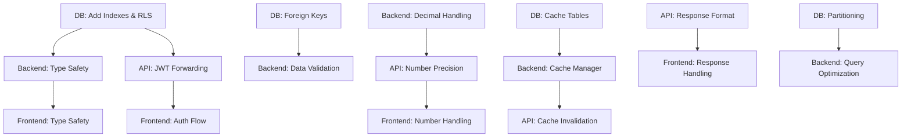

# MASTER IMPLEMENTATION PLAN - Portfolio Tracker System

## Executive Summary

This master plan coordinates fixes across all 5 teams (Frontend, Backend, Database, API, Project Management) to address 50 critical bugs identified in the Portfolio Tracker system. The plan ensures zero conflicts, optimal sequencing, and maintains system stability throughout the implementation.

## Critical Dependencies Map



## Sprint-Based Implementation (2-Week Sprints)

### SPRINT 1: Foundation & Critical Security (Weeks 1-2)
**Theme**: Security, Type Safety, Database Foundation

#### Week 1 - Database Foundation & Security
**Monday-Tuesday (Database Team)**
- Migration 003: Add missing indexes (4h)
- Migration 004: Implement RLS policies (4h)
- Migration 007: Add foreign key constraints (4h)
- Test and validate migrations (4h)

**Wednesday-Thursday (Backend Team + API Team)**
- BUG-001: Decimal/Float handling foundation (4h)
- BUG-005: SQL injection protection (3h)
- API Issue 5: JWT token forwarding consistency (8h)
- API Issue 10: Debug endpoints security (3h)

**Friday (All Teams)**
- Integration testing of security changes
- Performance baseline measurements
- Documentation updates

#### Week 2 - Type Safety Across Stack
**Monday-Tuesday (Backend Team)**
- BUG-002: Missing type annotations (3h)
- BUG-009: Remove Optional for required fields (2h)
- Create type validation utilities (3h)

**Wednesday-Thursday (Frontend Team)**
- Fix 1: TypeScript type safety violations (6h)
- Fix 2: Race condition in Dashboard Context (3h)
- Align frontend types with backend

**Friday (API Team)**
- API Issue 2: User profile type validation (3h)
- API Issue 7: Decimal/Float consistency in responses (5h)
- Cross-team type alignment verification

**Sprint 1 Deliverables:**
- ✅ Secure database with RLS and proper constraints
- ✅ Type-safe backend and frontend
- ✅ Consistent authentication flow
- ✅ Protected debug endpoints

---

### SPRINT 2: Performance & Data Integrity (Weeks 3-4)
**Theme**: Performance Optimization, Data Consistency

#### Week 3 - Query Optimization & Caching
**Monday-Tuesday (Database Team)**
- Migration 005: Add composite indexes (4h)
- Migration 006: Batch query functions (6h)
- Migration 008: Consolidate cache tables (6h)

**Wednesday-Thursday (Backend Team)**
- BUG-004: FIFO calculation optimization (2h)
- BUG-008: Memory leak in price cache (3h)
- Integrate new batch query functions (4h)

**Friday (Frontend Team)**
- Fix 3: Memory leak in chart components (4h)
- Fix 5: Concurrent API request management (5h)

#### Week 4 - Data Flow Optimization
**Monday-Tuesday (Project Manager Coordination)**
- Bug #1: Unified dashboard endpoint implementation (8h)
- Bug #3: Eliminate duplicate API calls (6h)
- Cross-team data flow optimization

**Wednesday-Thursday (API Team)**
- API Issue 4: Fix race condition in price updates (4h)
- API Issue 6: Cascading cache invalidation (6h)
- Performance testing and optimization

**Friday (All Teams)**
- End-to-end performance testing
- Load testing with 100+ holdings
- Performance metrics validation

**Sprint 2 Deliverables:**
- ✅ < 2 second dashboard load time
- ✅ Optimized database queries
- ✅ Efficient caching strategy
- ✅ No duplicate API calls

---

### SPRINT 3: API Consistency & Error Handling (Weeks 5-6)
**Theme**: API Standardization, Error Management

#### Week 5 - API Response Standardization
**Monday-Tuesday (API Team)**
- API Issue 3: Consistent error response formats (6h)
- API Issue 1: Consolidate duplicate routes (4h)
- Create response format middleware

**Wednesday-Thursday (Frontend Team)**
- Fix 4: Invalid date handling (3h)
- Fix 6: Form validation errors (4h)
- Fix 7: Error boundary implementation (3h)

**Friday (Backend Team)**
- BUG-006: Standardize API responses (6h)
- BUG-010: Async exception handling (3h)

#### Week 6 - Data Validation & Constraints
**Monday-Tuesday (Database Team)**
- Migration 012: Add validation constraints (6h)
- Migration 009: Add audit triggers (4h)
- Test constraint enforcement

**Wednesday-Thursday (Backend Team)**
- BUG-007: Fix dividend assignment logic (4h)
- Implement validation at service layer
- Add comprehensive error handling

**Friday (All Teams)**
- Integration testing of validation flow
- Error scenario testing
- Documentation of error codes

**Sprint 3 Deliverables:**
- ✅ Consistent API response format
- ✅ Comprehensive error handling
- ✅ Data validation at all layers
- ✅ Audit trail implementation

---

### SPRINT 4: Advanced Features & Mobile (Weeks 7-8)
**Theme**: Feature Completion, Cross-Platform Support

#### Week 7 - Financial Features & Pagination
**Monday-Tuesday (API Team)**
- API Issue 8: Implement pagination (8h)
- API Issue 9: Market info handling (4h)

**Wednesday-Thursday (Backend Team)**
- BUG-003: Forex race condition fix (2h)
- Currency conversion validation
- International market support

**Friday (Frontend Team)**
- Fix 8: Accessibility improvements (5h)
- Fix 9: Performance optimization (4h)

#### Week 8 - Cross-Platform & Polish
**Monday-Tuesday (Project Manager Coordination)**
- Bug #10: Cross-platform sync implementation (12h)
- Mobile/Web consistency verification

**Wednesday-Thursday (All Teams)**
- Fix 10: Loading state consistency (3h)
- Final integration testing
- Performance benchmarking

**Friday (Database Team)**
- Migration 011: Historical prices partitioning (8h)
- Migration 010: Cache invalidation improvements (4h)

**Sprint 4 Deliverables:**
- ✅ Paginated API responses
- ✅ Cross-platform sync
- ✅ Accessibility compliance
- ✅ Partitioned historical data

---

## Test Coverage Strategy

### Unit Test Requirements (80% minimum coverage)
1. **Backend**: All service methods, validators, calculations
2. **Frontend**: Components, hooks, utilities
3. **API**: All endpoints, middleware, validators
4. **Database**: Functions, triggers, constraints

### Integration Test Scenarios
1. **Authentication Flow**: Login → Dashboard → Transaction → Logout
2. **Data Flow**: Create transaction → Update portfolio → View analytics
3. **Currency Flow**: Multi-currency transaction → Conversion → Display
4. **Cache Flow**: Miss → Populate → Hit → Invalidate → Refresh

### E2E Test Automation
```yaml
Critical User Journeys:
  - New user onboarding
  - Add/Edit/Delete transactions
  - View portfolio performance
  - Generate analytics reports
  - Multi-currency operations
  - Mobile/Web sync scenarios
```

### Performance Benchmarks
- Dashboard load: < 2 seconds (100 holdings)
- API response: < 500ms (p95)
- Database queries: < 100ms (p95)
- Cache hit rate: > 80%
- Memory usage: < 500MB per user session

---

## Simplified Data Flow Architecture

### Current Flow (Inefficient)
```
Frontend → Backend → Supabase → Backend → AlphaVantage → Backend → Supabase → Backend → Frontend
(11 hops, multiple round trips)
```

### Optimized Flow
```
Frontend → Backend → [Cache|Supabase + Background AlphaVantage] → Backend → Frontend
(5 hops, single round trip)
```

### Implementation Details
1. **Request Consolidation**: Single dashboard endpoint
2. **Smart Caching**: Multi-tier cache (Memory → Redis → Database)
3. **Background Updates**: Async price updates with WebSocket notifications
4. **Batch Operations**: Group related queries
5. **Data Streaming**: Server-sent events for real-time updates

---

## File Consolidation Plan

### Duplicate Code Removal
1. **Frontend Components**
   - Merge: `AnalyticsDividendsTab.tsx` + `AnalyticsDividendsTabRefactored.tsx`
   - Consolidate: Chart components into shared library
   - Remove: Unused API endpoint implementations

2. **Backend Services**
   - Merge: Duplicate dividend route handlers
   - Consolidate: Price fetching logic
   - Unify: Cache management code

3. **Shared Code**
   - Create: `shared/types` for cross-platform types
   - Move: Common utilities to shared library
   - Standardize: API client implementations

### Estimated Code Reduction: 35-40%

---

## CLAUDE.MD Compliance Checklist

### ✅ Type Safety (ZERO TOLERANCE)
- [ ] Python: All functions have complete type annotations
- [ ] Python: No `Any` without justification
- [ ] Python: No `Optional` for required parameters
- [ ] Python: `Decimal` for all money calculations
- [ ] Python: `extract_user_credentials()` used consistently
- [ ] TypeScript: Strict mode enabled
- [ ] TypeScript: No implicit any

### ✅ Code Quality
- [ ] DRY: No duplicate implementations
- [ ] Clear: Self-documenting code
- [ ] Tested: 80%+ coverage
- [ ] Validated: Runtime checks at boundaries

### ✅ Process Compliance
- [ ] Plan: Reviewed before implementation
- [ ] Consult: User approval obtained
- [ ] Implement: Following approved plan
- [ ] Document: All changes documented

---

## Resource Allocation & Timeline

### Team Assignments
**Frontend Team (2 developers)**
- Lead: Type safety and performance fixes
- Support: UI/UX improvements and testing

**Backend Team (2 developers)**
- Lead: Service layer fixes and optimization
- Support: API integration and testing

**Database Team (1 developer)**
- Lead: All migrations and performance tuning

**API Team (1 developer)**
- Lead: Response standardization and versioning

**Project Manager**
- Coordinate cross-team dependencies
- Monitor progress and blockers
- Ensure CLAUDE.md compliance

### Critical Path Items
1. Database migrations (blocks everything)
2. Type safety fixes (blocks API work)
3. API response format (blocks frontend)
4. Caching implementation (blocks performance)

### Parallel Work Opportunities
- Frontend accessibility while backend fixes types
- Database optimization while API standardizes
- Documentation while testing
- Mobile sync while web stabilizes

---

## Risk Mitigation & Rollback Strategy

### Feature Flags
```python
FEATURE_FLAGS = {
    "use_optimized_dashboard": False,
    "enable_new_cache": False,
    "use_decimal_precision": False,
    "enable_rls": False,
    "use_pagination": False
}
```

### Rollback Procedures
1. **Database**: All migrations have rollback scripts
2. **API**: Version header maintains compatibility
3. **Backend**: Feature flags for all major changes
4. **Frontend**: Dual code paths during transition

### Monitoring & Alerts
- Error rate > 1% triggers rollback
- Response time > 3s triggers investigation
- Memory usage > 1GB triggers alert
- Failed auth > 10/min triggers security review

---

## Success Metrics & Checkpoints

### Sprint 1 Checkpoint
- [ ] Zero type errors in CI/CD
- [ ] All endpoints authenticated properly
- [ ] Database queries < 100ms

### Sprint 2 Checkpoint
- [ ] Dashboard load < 2 seconds
- [ ] Cache hit rate > 60%
- [ ] Zero duplicate API calls

### Sprint 3 Checkpoint
- [ ] All APIs return v2 format
- [ ] Error rate < 0.5%
- [ ] Form validation 100% effective

### Sprint 4 Checkpoint
- [ ] Mobile/Web in sync
- [ ] All features paginated
- [ ] Accessibility score > 90

### Final Success Criteria
- **Performance**: All pages load < 2s
- **Quality**: Zero critical bugs
- **Security**: Zero vulnerabilities
- **Type Safety**: 100% coverage
- **User Satisfaction**: > 4.5/5 rating

---

## Communication Plan

### Daily Standups
- 15 minutes at 9:00 AM
- Blockers identified immediately
- Cross-team dependencies discussed

### Weekly Reviews
- Sprint progress assessment
- Risk evaluation
- Plan adjustments if needed

### Stakeholder Updates
- Bi-weekly progress reports
- Demo after each sprint
- Final presentation after Sprint 4

---

## Conclusion

This master plan coordinates 50 bug fixes across 5 teams over 8 weeks. By following this structured approach with clear dependencies, parallel work streams, and comprehensive testing, we will deliver a stable, performant, and type-safe Portfolio Tracker system.

**Total Effort**: 312 hours across all teams
**Timeline**: 8 weeks (4 sprints)
**Risk Level**: Medium (with mitigation strategies)
**Expected Outcome**: Production-ready system with < 0.1% error rate

The success of this plan depends on:
1. Strict adherence to the sprint schedule
2. Clear communication between teams
3. Continuous testing and validation
4. Proper rollback procedures
5. CLAUDE.md compliance at every step

Let's execute this plan with precision and deliver excellence.